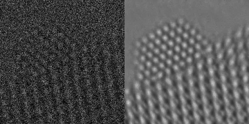
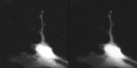
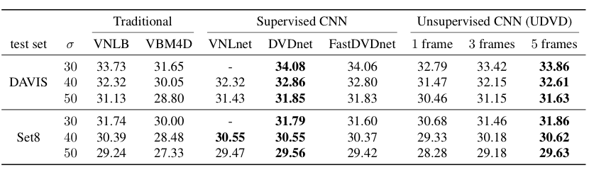
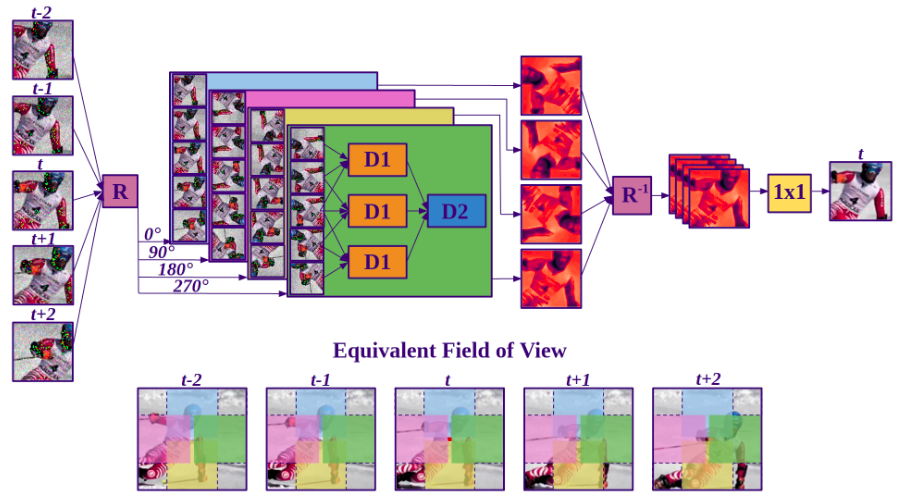
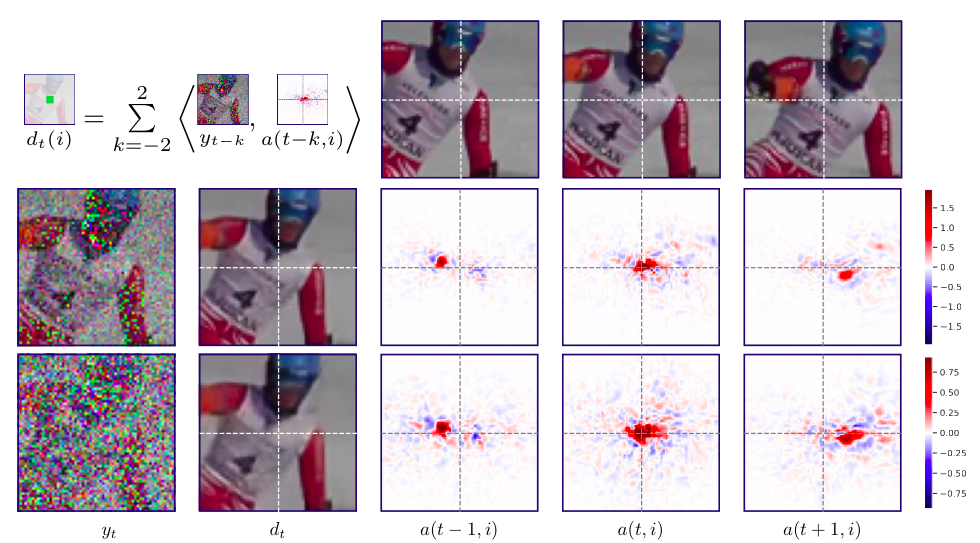

This website contains code and pre-trained models from the paper [Unsupervised Deep Video Denoising](https://arxiv.org/abs/2010.12970) by [Dev Sheth](https://www.linkedin.com/in/dev-sheth/) \*, [Sreyas Mohan](https://sreyas-mohan.github.io) \*, [Joshua Vincent](https://crozier.engineering.asu.edu/people/current-graduate-students/josh-vincent/), [Ramon Manzorro](https://crozier.engineering.asu.edu/ramon-manzorro/), [Peter A Crozier](https://crozier.engineering.asu.edu/people/peter-a-crozier/), [Mitesh M Khapra](https://www.cse.iitm.ac.in/~miteshk/), [Eero P Simoncelli](https://www.cns.nyu.edu/~eero/) and [Carlos Fernandez-Granda](https://cims.nyu.edu/~cfgranda/) [\* - Equal Contribution].

Rafting           |  Snowboard
:-------------------------:|:-------------------------:
  |  

**Natural Image Videos Denoised Using UDVD** UDVD trained on the DAVIS train set applied to noisy natural image videos. 

Electron Microscopy           |  Fluroscence Microscopy
:-------------------------:|:-------------------------:
 | 

**Real Microscopy Videos Denoised Using UDVD** UDVD trained on 35 frames of highly noisy electron microscopy data.

Deep convolutional neural networks (CNNs)   currently achieve state-of-the-art performance in denoising videos. They are typically trained with supervision, minimizing the error between the network output and ground-truth clean videos. However, in many applications, such as microscopy, noiseless videos are not available. To address these cases, we build on recent advances in unsupervised still image denoising to develop an Unsupervised Deep Video Denoiser (UDVD). UDVD is shown to perform competitively with current state-of-the-art supervised methods on benchmark datasets, even when trained only on a single short noisy video sequence. Experiments on fluorescence-microscopy and electron-microscopy data illustrate the promise of our approach for imaging modalities where  ground-truth clean data is generally not available. In addition, we study the mechanisms used by trained CNNs to perform video denoising.  An analysis of the gradient of the network output with respect to its input reveals that these networks perform spatio-temporal filtering that is adapted to the particular spatial structures and motion of the underlying content. We interpret this as an implicit and highly effective form of motion compensation, a widely used paradigm in traditional video denoising, compression, and analysis.

## Results

 

**Denoising results for natural image data** All networks are trained on the DAVIS train set. Performance values are PSNR of each trained network averaged over held-out test data. UDVD, operating on $5$ frames, outperforms the supervised methods on Set8 and is competitive on the DAVIS test set.  Unsupervised denoisers with more temporal frames show a consistent improvement in denoising performance. DVDnet and FastDVDnet are trained using varying noise levels ($\sigma \in [0, 55]$) and VNLnet is trained and evaluated on each specified noise level. All unsupervised CNNs are trained ***only*** at $\sigma=30$, showing that they generalize well on unseen noise levels. See paper for additional results.  

## Architecture

 

**Multi-frame blind-spot architecture**. Our CNN maps five contiguous noisy frames to a denoised estimate of the middle frame. Building 
 on the *blind spot* idea proposed in Laine et al. (2019) for single-image denoising, we design the architecture so that each output pixel is estimated from a spatiotemporal neighbourhood that does not include the pixel itself. 
 We rotate the input frames by multiples of $90^{\circ}$ and process them through four separate branches containing asymmetric convolutional filters that are *vertically causal*. As a result, the branches produce outputs that only depend on the pixels above ($0^{\circ}$ rotation), to the left ($90^{\circ}$), below ($180^{\circ}$) or to the right ($270^{\circ}$) of the output pixel. These partial outputs are then *derotated* and combined using a three-layered cascade of $1\times 1$ convolutions and nonlinearities to produce the final output. The resulting field of view is depicted at the bottom of figure.  

## Analysis

 

**UDVD implements non-linear adaptive filtering**  Visualization of the linear weighting functions ($a(k,i)$, Eq.2 in paper) of UDVD. The left two columns show the noisy frame $y_t$ at two levels of noise, and the corresponding denoised frame, $d_t$.  Weighting functions $a(k, i)$ corresponding to the pixel $i$ (at the intersection of the dashed white lines), for three successive frames, are shown in the last three columns. The weighting functions adapt to underlying image content, and are shifted to track the motion of the skier. As the noise level $\sigma$ increases, their spatial extent grows, averaging out more of the noise while respecting object boundaries. The weighting functions corresponding to the five frames approximately sum to one, and thus compute a local average (although some weights are negative, depicted in blue).

 

**UDVD automatically learn to perform motion estimation.** (a) Noisy frame from a video in the DAVIS dataset. (b) Optical flow direction at multiple locations of the image obtained using a state-of-the-art algorithm applied *to the clean video*. (c) Optical flow direction estimated from the shift of the adaptive filter obtained by using the gradient of the network, which is trained exclusively with noisy videos and no optical flow information. Optical flow estimates are well-matched to those in (b), but deviate according to the aperture problem at oriented features (ess black vertical edge of bus door), and in homogeneous regions (see bus roof, top right).

## Pre-Trained Models and Code
Please visit [our github page](https://github.com/sreyas-mohan/udvd) for pre-trained models, code and instructions on how to use the code. 

